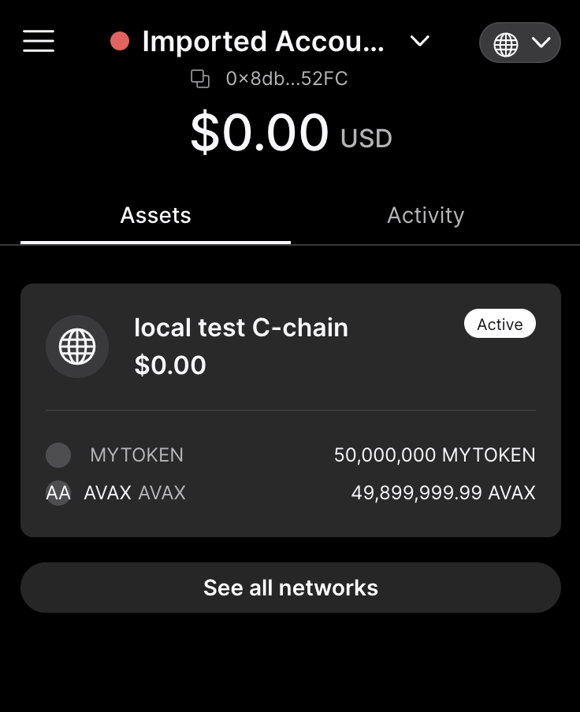

# Connect to local DEVNET and fund the wallet

_In the world of Avalanche, we refer to short-lived, test Subnets as Devnets._ (source [HyperSDK](https://github.com/ava-labs/hypersdk/blob/0907bf7c016c3ab569952201270e37cdfb8592b1/examples/tokenvm/DEVNETS.md))

The easiest way to test your contract is to spin up a local DEVNET to use its C-Chain (EVM Chain).

If you prefer testing with a Glitch Hackathon DEVNET, see [here](./2-connect-to-glitch-devnet-and-fund-the-wallet.eng.md#rpc-url).

## RPC URL

The RPC URL of the local DEVNNET is:

```bash
# copy this for examples here
export EVM_CHAIN_RPC_URL=http://localhost:9650/ext/bc/C/rpc
```

## Install Go

AvalancheGo compilation requires Go. So, make sure your environment has Go installed.

```bash
go version
```

## Install Foundry

We will use [Foundry](https://github.com/foundry-rs/foundry) to deploy and interact with smart contracts.

Please visit [Foundry installation](https://github.com/foundry-rs/foundry#installation) for further instructions.

```bash
forge --version
cast --version
```

## Download AvalancheGo code base

git clone the repository from [ava-labs/avalanchego](https://github.com/ava-labs/avalanchego):

```bash
cd ${HOME}
git clone git@github.com:ava-labs/avalanchego.git
cd ./avalanchego
```

## Compile AvalancheGo code base

```bash
cd ${HOME}/avalanchego
./scripts/build.sh
find ./build

# make sure your dev environment can execute the binary
./build/avalanchego --version
```

## Start the local AvalancheGo network

```bash
cd ${HOME}/avalanchego
./build/avalanchego \
--network-id=local \
--staking-enabled=false \
--db-type=memdb \
--log-level=info
```

To connect to this DEVNET outside of your dev environment (e.g., connect to the DEVNET running in a remote EC2 instance), you can optionally expose the 9650 port to allow all traffic with the `--http-host=0.0.0.0`. Note that you do not need to do this if you only test locally in your local dev environment (e.g., within your laptop):

```bash
cd ${HOME}/avalanchego
./build/avalanchego \
--network-id=local \
--http-host=0.0.0.0 \
--staking-enabled=false \
--db-type=memdb \
--log-level=info
```

## Test the local AvalancheGo network endpoints

Now this local Avalanche network has the following endpoints:

```yaml
http_rpc: http://localhost:9650
http_rpc_x: http://localhost:9650/ext/bc/X
http_rpc_p: http://localhost:9650/ext/bc/P
http_rpc_c: http://localhost:9650/ext/bc/C/rpc
metrics: http://localhost:9650/ext/metrics
health: http://localhost:9650/ext/health
liveness: http://localhost:9650/ext/health/liveness
metamask_rpc_c: http://localhost:9650/ext/bc/C/rpc
websocket_rpc_c: ws://localhost:9650/ext/bc/C/ws
```

Following are some of the examples you can test the above local DEVNET:

**To get the currenet node ID:**

```bash
curl -X POST --data '{
    "jsonrpc":"2.0",
    "id"     :1,
    "method" :"info.getNodeID"
}' -H 'content-type:application/json;' http://localhost:9650/ext/info
```

Then, you can get the current node ID as follows:

```json
{"jsonrpc":"2.0","result":{"nodeID":"NodeID-6NeWXVweQgfHgxY4WLn1XKg5niPfUGsZn"
```

**To get the network ID:**

```bash
curl -X POST --data '{
    "jsonrpc":"2.0",
    "id"     :1,
    "method" :"info.getNetworkID"
}' -H 'content-type:application/json;' http://localhost:9650/ext/info
```

Then, you can get the network ID as follows:

```json
{"jsonrpc":"2.0","result":{"networkID":"12345"},"id":1}
```

See [avalanchego/apis](https://docs.avax.network/apis/avalanchego/apis) to try out other APIs.

## Test the local AvalancheGo network with web wallets

We will use the following test keys to integrate the Avalanche local DEVNET with the [Core wallet](https://core.app). Note that the key that starts with `ewoq` is the canonical test key used in our local DEVNET, pre-funded through the genesis block:

```json
[
    {
        "key_type": "hot",
        "private_key_cb58": "PrivateKey-ewoqjP7PxY4yr3iLTpLisriqt94hdyDFNgchSxGGztUrTXtNN",
        "private_key_hex": "0x56289e99c94b6912bfc12adc093c9b51124f0dc54ac7a766b2bc5ccf558d8027",
        "addresses": {
            "12345": {
                "x_address": "X-local18jma8ppw3nhx5r4ap8clazz0dps7rv5u00z96u",
                "p_address": "P-local18jma8ppw3nhx5r4ap8clazz0dps7rv5u00z96u"
            }
        },
        "short_address": "6Y3kysjF9jnHnYkdS9yGAuoHyae2eNmeV",
        "eth_address": "0x8db97C7cEcE249c2b98bDC0226Cc4C2A57BF52FC",
        "h160_address": "0x8db97c7cece249c2b98bdc0226cc4c2a57bf52fc"
    },
    {
        "key_type": "hot",
        "private_key_cb58": "PrivateKey-if94hLX5xK14jChGZUsh7PSBsBT8KkRNAwS88NoHeTxZNbJh2",
        "private_key_hex": "0x5e96aefcb014670192ad0a5a95bf5dfe8f62537b99327a13a942c127913c0281",
        "addresses": {
            "12345": {
                "x_address": "X-local1myazn9837mrey0zxmqrzjfgt605e72fey4n9mp",
                "p_address": "P-local1myazn9837mrey0zxmqrzjfgt605e72fey4n9mp"
            }
        },
        "short_address": "LobJpmdncFrFRYtUj4oiUKKWzg9eR4KSX",
        "eth_address": "0x53C62F5d19f94556c4e9E9Ee97CeE274AB053399",
        "h160_address": "0x53c62f5d19f94556c4e9e9ee97cee274ab053399"
    }
]
```

## Connect to chain using Core web wallet

Install the Core wallet extension [here](https://core.app).

### Step 1. add the Avalanche EVM network to the Core wallet

Get the chain Id from the [local DEVNET](#rpc-url):

```bash
curl ${EVM_CHAIN_RPC_URL} \
-X POST \
-H "Content-Type: application/json" \
--data '{"method":"eth_chainId","params":[],"id":1,"jsonrpc":"2.0"}'
# {"jsonrpc":"2.0","id":1,"result":"0xa868"}
```

```bash
# to convert the hexadecimal number to decimal
cast --to-dec 0xa868
# 43112

echo $((16#a868))
# 43112
```

Use this chain Id and the RPC URL `${EVM_CHAIN_RPC_URL}` (e.g., `http://localhost:9650/ext/bc/C/rpc`) to connect to the local Avalanche DEVNET:


### Step 2. import the test `ewoq` key using its hex-encoded private key

Use the pre-funded key `56289e99c94b6912bfc12adc093c9b51124f0dc54ac7a766b2bc5ccf558d8027`.

Click the drop down next to your account name:


Click "imported" tab:


Import the hex-private key:


### Step 3. check balance

```bash
# ewoq key address is "0x8db97C7cEcE249c2b98bDC0226Cc4C2A57BF52FC"
curl ${EVM_CHAIN_RPC_URL} \
-X POST \
-H "Content-Type: application/json" \
-d '{"jsonrpc":"2.0","method":"eth_getBalance","params":["0x8db97C7cEcE249c2b98bDC0226Cc4C2A57BF52FC", "latest"],"id":0}'

# check P-chain balance (this is not shown in Core yet)
curl --location --request POST 'http://localhost:9650/ext/bc/P' \
--header 'Content-Type: application/json' \
--data-raw '{
    "jsonrpc":"2.0",
    "id"     :1,
    "method" :"platform.getBalance",
    "params" :{
      "addresses":["P-local18jma8ppw3nhx5r4ap8clazz0dps7rv5u00z96u"]
    }
}'
# {"jsonrpc":"2.0","result":{"balance":"30000000000000000",...
```


### Step 4. transfer some tokens to another test key of zero balance

We will use the second key in the above JSON:

```bash
# another key address is "0x53C62F5d19f94556c4e9E9Ee97CeE274AB053399"
curl ${EVM_CHAIN_RPC_URL} \
-X POST \
-H "Content-Type: application/json" \
-d '{"jsonrpc":"2.0","method":"eth_getBalance","params":["0x53C62F5d19f94556c4e9E9Ee97CeE274AB053399", "latest"],"id":0}'
```




### Step 5. make sure the tokens got transfered by checking the balance of two accounts

```bash
# ewoq key address is "0x8db97C7cEcE249c2b98bDC0226Cc4C2A57BF52FC"
curl ${EVM_CHAIN_RPC_URL} \
-X POST \
-H "Content-Type: application/json" \
-d '{"jsonrpc":"2.0","method":"eth_getBalance","params":["0x8db97C7cEcE249c2b98bDC0226Cc4C2A57BF52FC", "latest"],"id":0}'
# {"jsonrpc":"2.0","id":0,"result":"0x2946bc6b88d726f8f3a400"}

cast --to-dec 0x2946bc6b88d726f8f3a400
# 49899999994566250000000000
```

```bash
# another key address is "0x53C62F5d19f94556c4e9E9Ee97CeE274AB053399"
curl ${EVM_CHAIN_RPC_URL} \
-X POST \
-H "Content-Type: application/json" \
-d '{"jsonrpc":"2.0","method":"eth_getBalance","params":["0x53C62F5d19f94556c4e9E9Ee97CeE274AB053399", "latest"],"id":0}'
# {"jsonrpc":"2.0","id":0,"result":"0x152d02c7e14af6800000"}

cast --to-dec 0x152d02c7e14af6800000
# 100000000000000000000000
```
