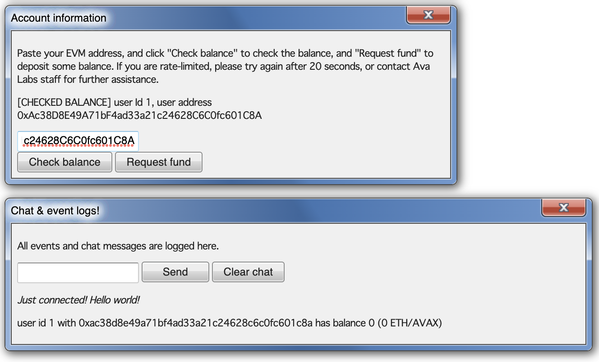

# Connect to Glitch Hackathon DEVNET and fund the wallet

_In the world of Avalanche, we refer to short-lived, test Subnets as Devnets._ (source [HyperSDK](https://github.com/ava-labs/hypersdk/blob/0907bf7c016c3ab569952201270e37cdfb8592b1/examples/tokenvm/DEVNETS.md))

Ava Labs already set up a dedicated Glitch Hackathon subnet (DEVNET) using [subnet-evm](https://github.com/ava-labs/subnet-evm).

## RPC URL

The RPC URL of the Glitch Hackathon subnet is:

```bash
# copy this for examples here
export EVM_CHAIN_RPC_URL=http://aops-custom-202305-fXPSse-nlb-c126d65745880389.elb.us-west-2.amazonaws.com:9650/ext/bc/KFXPAPGtsvmKq76GdH3Y2ghjaqjhRhTkesiNEqL6E5a4YKRhB/rpc
```

## Install Foundry

We will use [Foundry](https://github.com/foundry-rs/foundry) to deploy and interact with smart contracts.

Please visit [Foundry installation](https://github.com/foundry-rs/foundry#installation) for further instructions.

```sh
forge --version
cast --version
```

## Connect to chain using Core web wallet

Install the Core wallet extension [here](https://core.app) and create/import a wallet:

### Step 1. add the Avalanche EVM network to the Core wallet

Get the chain Id from the [Glitch Hackathon DEVNET](#rpc-url):

```bash
curl ${EVM_CHAIN_RPC_URL} \
-X POST \
-H "Content-Type: application/json" \
--data '{"method":"eth_chainId","params":[],"id":1,"jsonrpc":"2.0"}'
# {"jsonrpc":"2.0","id":1,"result":"0x1e8789"}
```

```bash
# to convert the hexadecimal number to decimal
cast --to-dec 0x1e8789
# 2000777

echo $((16#1e8789))
# 2000777
```

And connect to the chain as follows:


### Step 2. fund your wallet using Glitch Hackathon DEVNET faucet

We've set up a DEVNET faucet for Glitch Hackathon. Just paste your EVM address to get the funding. This faucet has rate limits to prevent DDoS attacks. Please reach out to Ava Labs staff for funding issues:

DEVNET faucet URL: **http://52.27.115.224:3031**

Copy and paste your EVM address, and click "Request fund" button.



### Step 3. check balance

You can copy and paste your EVM address, and check "Check balance".

Or use the following commands:

```bash
# update with your EVM address
export MY_WALLET_EVM_ADDRESS="0x..."
```

```bash
curl ${EVM_CHAIN_RPC_URL} \
-X POST \
-H "Content-Type: application/json" \
-d "{\"jsonrpc\":\"2.0\",\"method\":\"eth_getBalance\",\"params\":[\"${MY_WALLET_EVM_ADDRESS}\", \"latest\"],\"id\":0}"
```
