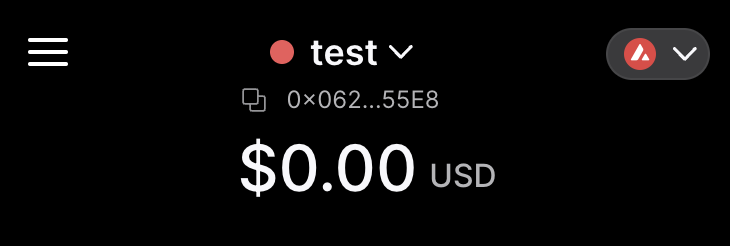

# Connect to Glitch Hackathon DEVNET and fund the wallet

_In the world of Avalanche, we refer to short-lived, test Subnets as Devnets._ (source [HyperSDK](https://github.com/ava-labs/hypersdk/blob/0907bf7c016c3ab569952201270e37cdfb8592b1/examples/tokenvm/DEVNETS.md))

Ava Labs already set up a dedicated Glitch Hackathon subnet (DEVNET) using [subnet-evm](https://github.com/ava-labs/subnet-evm).

*This DEVNET will be shut down at `Tue May 23 23:00:00 UTC 2023`. To keep your demos, please use screen recording.*

## RPC URL

The RPC URL of the Glitch Hackathon subnet is:

```bash
# copy this for examples here
export EVM_CHAIN_RPC_URL=http://aops-custom-202305-2crvsg-nlb-1d600174371701f9.elb.ap-northeast-2.amazonaws.com:9650/ext/bc/XpX1yGquejU5cma1qERzkHKDh4fsPKs4NttnS1tErigPzugx5/rpc
```

## Install Foundry

We will use [Foundry](https://github.com/foundry-rs/foundry) to deploy and interact with smart contracts.

Please visit [Foundry installation](https://github.com/foundry-rs/foundry#installation) for further instructions.

```sh
forge --version
cast --version
```

## Connect to chain using Core web wallet

Install the Core wallet extension [here](https://core.app) and create/import a wallet:

### Step 1. add the Avalanche EVM network to the Core wallet

Get the chain Id from the [Glitch Hackathon DEVNET](#rpc-url):

```bash
curl ${EVM_CHAIN_RPC_URL} \
-X POST \
-H "Content-Type: application/json" \
--data '{"method":"eth_chainId","params":[],"id":1,"jsonrpc":"2.0"}'
# {"jsonrpc":"2.0","id":1,"result":"0x1e8789"}
```

```bash
# to convert the hexadecimal number to decimal
cast --to-dec 0x1e8789
# 2000777

echo $((16#1e8789))
# 2000777
```

And connect to the chain as follows:


### Step 2. generate and import test private key

For contract deployment with [Foundry](https://github.com/foundry-rs/foundry), you may need to use hex-encoded private key. Note that neither MetaMask nor Core supports key export in hex encoding. So, if you want to use [Foundry](https://github.com/foundry-rs/foundry) and Core wallet with the same key, we recommend generating a hotkey using [`avalanche-kms`](https://github.com/ava-labs/avalanche-ops/tree/main/avalanche-kms) command line interface 
and importing the hex-encoded private key into Core wallet as follows:

To generate a hotkey, first download `avalanche-kms` from the [Github release page](https://github.com/ava-labs/avalanche-ops/releases/tag/latest), and run the following command:

```bash
avalanche-kms create \
--key-type hot \
--keys 1
```

Sample outputs are:

```yaml
key_type: hot
private_key_cb58: PrivateKey-zf6TUm8bfpmU4qfUQHzusn4bimccyanXNou1ubcKA1848w7oX

# make sure to copy/paste to the wallet without "0x"
private_key_hex: 0x82eab3bdabe8022afdecbf5b507eaa58533243adcbdf5620a398fceab143afdc

addresses:
  1:
    x: X-avax1ynl26r0ewvjjvkt2gw4yzk9rrqtxrnddtqj7k7
    p: P-avax1ynl26r0ewvjjvkt2gw4yzk9rrqtxrnddtqj7k7
short_address: 4NcR73ZWY661erLJfgV2P1G8KmaNZ7BLU
eth_address: 0x0104cDeB19a9075c73a0d487B0BB702e970eCAD6
h160_address: 0x0104cdeb19a9075c73a0d487b0bb702e970ecad6
```

To import the key, click the drop down next to your Core account name:



Then click "imported" tab:


To import the hex-private key:


If you need funding on this account, use the [DEVNET faucet](#step-3-fund-your-wallet-using-glitch-hackathon-devnet-faucet) using the `eth_address`.

### Step 3. fund your wallet using Glitch Hackathon DEVNET faucet

We've set up a DEVNET faucet for Glitch Hackathon. Just paste your EVM address to get the funding. This faucet has rate limits to prevent DDoS attacks. Please reach out to Ava Labs staff for funding issues:

DEVNET faucet URL: **http://52.27.115.224:3031**

Copy and paste your EVM address, and click "Request fund" button.


### Step 4. check balance

You can copy and paste your EVM address, and check "Check balance".

Or use the following commands:

```bash
# update with your EVM address
export MY_WALLET_EVM_ADDRESS="0x..."
```

```bash
curl ${EVM_CHAIN_RPC_URL} \
-X POST \
-H "Content-Type: application/json" \
-d "{\"jsonrpc\":\"2.0\",\"method\":\"eth_getBalance\",\"params\":[\"${MY_WALLET_EVM_ADDRESS}\", \"latest\"],\"id\":0}"
```
